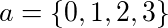

# Divergent Policies

## This is still being actively trained, thus results are subject to change.

## Training and Evaluation

To perform training, the **mode** must be set to *train*, and the weights folder specified. Here it is specified as exports. This is where model checkpoints will be stored.
```
$ python train.py --mode train --weights exports
```

To evaluate the model, the **mode** must be set to *eval*, and the weights folder specified. Here it is specified as exports. Evaluation will run the game on a variety of widths and heights, and export the results as a gif.
```
$ python train.py --mode eval --weights exports
```

<br>
<p align="center">
  
</p>

## Explanation
Consider the game of snake, with a a set of possible actions a,


<!--
a = \{0, 1, 2, 3\}
-->

Given a ternary reward signal, that is one that produces,
* negative feedback upon the actors termination
* neutral feedback when only traversal is achieved
* positive feedback when the actor has acquired an apple

A greedy policy can be optimized via calculating the Kullback-Leibler divergence between the policy's distribution and some reward-response target distribution. It is considered greedy as this method is reward chasing, and does not consider future value of actions.

Here, a reward-response target distribution is a discrete distribution, 
similar to that of the policy's action-space distribution. 
It is a compliment to the policy, and is given as a dynamic response to the reward signal. This is formally defined below in two parts, to increase the readability of the piecewise function.

## Positive Reinforcement
In the case of that which a positive reward signal is given, under a policy with respect to some parameters,
the target distribution can be calculated as:


<!--
p(x_a, \pi_s) \[ \begin{cases} 
      1 & x = arg\,max(\pi_s) \\
      0 & x \neq arg\,max(\pi_s) \\
   \end{cases}
\]
-->

Informally, this proposes that whichever action was taken, given a certain state, take a step in the direction such that in future this action is more likely, whilst other actions are less. Below this can be seen with the policy on the left, being fit to the reward-response target on the right.

<p align="center">
  
</p>


## Negative Reinforcement

Contrasting this, when given a negative signal the agent should consider the action taken to be less likely in future. Thus, we compute the target as follows:


<!--
p(x_a, \pi_s) \[ \begin{cases} 
      0 & x = arg\,max(\pi_s) \\
      \frac{1}{|a| - 1} & x \neq arg\,max(\pi_s) \\
   \end{cases}
\]
-->

By doing so we are suggesting that we do not know anything about the actions not taken, but we do know in future we should not take the action that was taken. Below the policy can be again seen on the left, being fit to the target on the right. 

<p align="center">
  
</p>

## Fully Convolutional Policies and Generality
The agent operates under a policy which is given as a fully convolutional network, using channel-wise average pooling for the reduction from feature maps to probabilities. To strive for generality of kernels learnt, the game dimensions are randomly sampled from a uniform distribution (*between bounds*) after each episode. The network architecture is as follows: 

| Layer                 | Kernels | Size | Dilation | Stride |
|:---------------------:|:-------:|:----:|:--------:|:------:|
| ReflectionPad (4)     |         |      |          |        |
| 2D Convolution        |   64    |   2  |    1     |    1   |
| ELU                   |         |      |          |        |
| ReflectionPad (4)     |         |      |          |        |
| 2D Convolution        |   64    |   2  |    2     |    1   |
| ELU                   |         |      |          |        |
| 2D Convolution        |   4     |   2  |    1     |    1   |
| ELU                   |         |      |          |        |
| Average Pooling (1,1) |         |      |          |        |
| ( Softmax )           |         |      |          |        |

## Histories and Stagnation
To maximize sample efficiency, a temporal difference learning approach is applied, using a history of the agents actions recorded relative to the last step a reward signal was received. Upon receiving a reward signal, target distributions are collected for all actions in the history. Optimization is then performed using gradients calculated from the mini-batch of divergences, and the history is subsequently cleared. 

It is proposed that over a period of time given sufficient sampling the agent can learn strategies for state traversal.
In order to prevent state traversal loops however, a stagnation factor is applied such that if a reward signal is not received after a given amount of steps, apply a negative reward signal. With the agent's history, this signal will then backpropagate through all states, thus in effect negating the feedback loop.

It is known that at the beginning of an agents training, actions made will be essentially random. Due to this, stagnation is a function dependent on the steps taken. This is done so to allow a harsher treatment of the agent at the start, which in theory should promote strategies that take the minimum amount of steps between rewards. It is defined below, where D is the stagnation duration constant, and w and h are the game width and height respectively.

<br>


## Results and Discussion

As expected of a greedy algorithm, some of the replays show a lack of planning, creating inescapable paths and so on. Given an expected value term, like those used in other methods, it is speculated to alleviate this issue and converge to a more fruitful region. It is the terminations due to sudden collisions with the exterior wall however, that lead me to believe these "_instinctual_" methods are more problematic than accounted for.

Consider instead an agent that performs the scientific method:
* searches for truths (_rules_) about their environment
* sufficiently tries to contradict their beliefs
* then finally, maximises some future expected reward 

It is with this, an agent that pragmatically and abstractly reasons, that I believe will lead to a more genuine sence of the term, artifically intelligent. In theory it should be able to learn these rules, and learn relationships between its own rules to come up with new emergent rules, internally. Regardless of what direction is taken, _ultimately I believe there is a fundamentally better framework to be found_. 

<p align="center">
  
  
  

  
   
  

  
    
    
</p>
